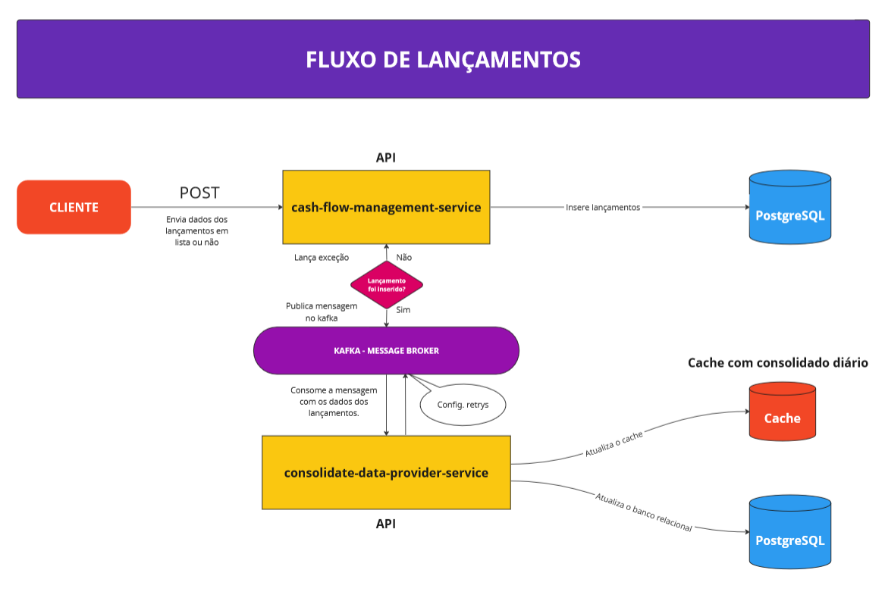
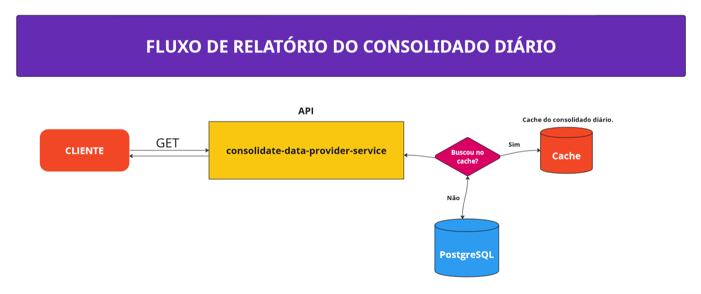

# Serviço de Provedor de Saldo

Serviço de Provedor de Saldo com a finalidade de estudos.

O projeto utiliza um serviço responsavel por prover o saldo consolidado dos lançamentos de créditos e débitos. Este
projeto consome mensagens de um tópico d kafka que está containerizado no serviço **consolidate-data-provider-service**.

### Versão Java

Foi utilizado o JDK 8 para o desenvolvimento deste teste.

### Frameworks

Foi utilizado como base do projeto o Spring Boot 2.7.12. Algumas bibliotecas adicionais, da própria suite do spring:

* **spring-boot-starter-data-jpa** - Core do Spring Boot para uso de JPA nos projetos
* **spring-boot-starter-web** - Core do Spring Boot para API's
* **spring-boot-starter-cloud** - Fornece uma série de ferramentas que facilitam a criação de aplicações distribuídas e
  escaláveis.
* **spring-boot-kafka** - Apache Kafka é uma plataforma popular de streaming de eventos usada para coletar, processar e
  armazenar dados de eventos de streaming ou dados que não têm início ou fim distintos.
* **spring-boot-starter-data-redis** - O Spring Data Redis aplica os principais conceitos do Spring, usando um
  armazenamento de dados com estilo de key-value. Fornecendo um “modelo” como uma abstração de alto nível.
* **spring-boot-devtools** - Utilitários do Spring Boot para desenvolvedores
* **org.postgresql** - Driver para postgres
* **hibernate-validator** - Biblioteca adicional do Hibernate para adicionar os validadores JPA do Hibernate
* **org.flywaydb** - Ferramenta para realizar *migrations* em bancos de dados, mantém os bancos atualizados em produção.

### Processamento assíncrono

Este projeto contem processamento assíncrono e usa o **kafka** para consumir mensagens de lançamentos para consolidar o
saldo

### Caching

Este projeto contem o Redis Cache para melhorar a resposta do saldo consolidado mais rápido para o cliente. No arquivo
docker-compose possui também o redis-commander usado para visualizar, editar e gerenciar um banco de dados Redis.


### Conteinerização

Foi configurado também para este projeto, um Dockerfile simples, que consiste em pegar o jar gerado pelo projeto, que já
é auto-executável, e embutir em uma imagem docker junto do openjdk 8. As imagens compiladas estão disponíveis
em: https://hub.docker.com/repository/docker/gustavoanalistabr/consolidate-data-provider-service

Para o ambiente de desenvolvimento, também está disponível um arquivo docker-compose, na pasta infra, que levanta os
serviços de banco de dados, kafka e do Kafdrop para acessar cliente do kafka.

## Desenho de Arquiteura de Solução

### Fluxo de Lançamentos:



### Fluxo de Relatório Consolidado:



### Como inciar o serviço:

#### Antes de iniciar este serviço é necessário executar o comando **docker-compose up -d** no serviço *
*CASH-FLOW-MANAGEMENT-SERVICE**

```
docker-compose up -d
```

* Este projeto possui o kafka, porém, para evitar que tivessemos instâncias diferentes do kafka, no docker-compose do
  serviço **CASH-FLOW-MANAGEMENT-SERVICE**.

### - **Endpoint da API buscar o saldo:**

```
curl --location 'localhost:8094/v1/movement' \
--header 'Content-Type: application/json' \
--data '[
    {
        "description": "Supermercados Comper",
        "person_id": "127f2c03-61d3-46a9-a467-34d582c43fe0",
        "date": "2023-05-07",
        "type_movement": "C",
        "value": 1000.00
    }
]'
```

### - **Endpoint da API gerar relatorio (pdf) do saldo:**

```
curl --location 'localhost:8093/v1/balance/report/127f2c03-61d3-46a9-a467-34d582c43fe0?date=2023-05-07'
```


